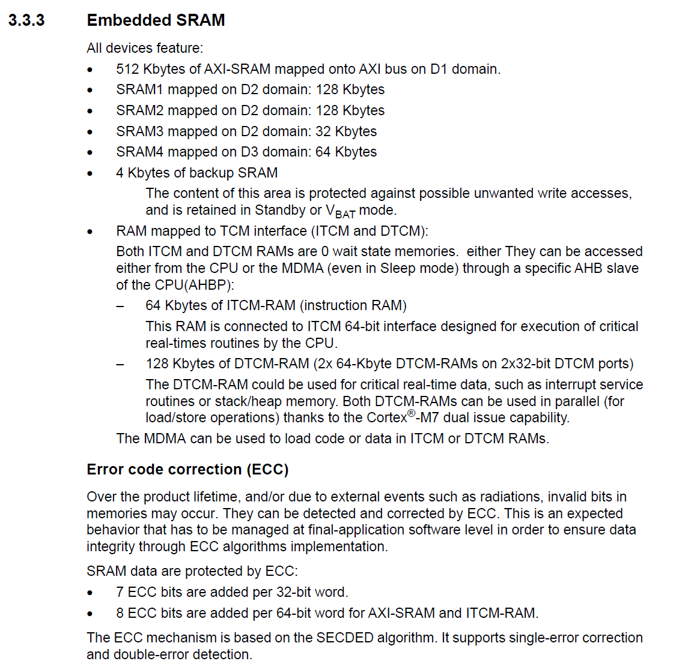
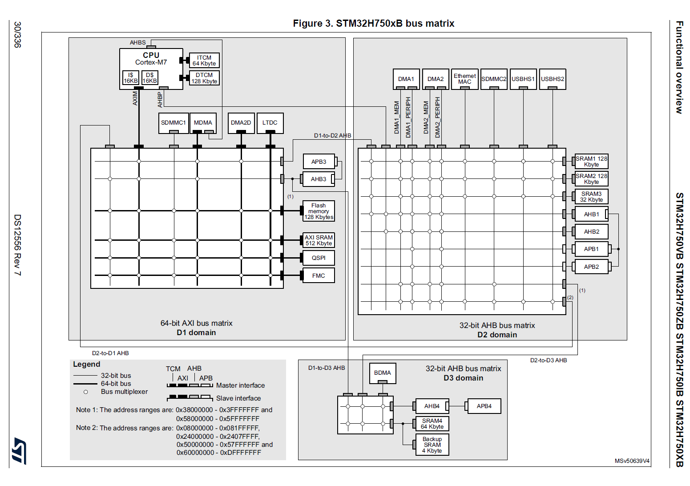

| 项目项       | 内容                        |
| ------------ | --------------------------- |
| 文档编号     | 00                          |
| 文档名称     | 平台与模型预研验证文档      |
| 所属项目     | TinyML-DualModel-Controller |
| 编写人       | 宋子恒                      |
| 编写日期     | 2025年6月12日               |
| 审核人       |                             |
| 项目目标芯片 | STM32H750XBH6               |
| 版本         | v0.1 初稿                   |
| 修订记录     | 初始版本                    |

## 1 平台资源概览

### 1.1 内存分布

​				*图：STM32H750 内存区域映射参考图（见 RM0433 3.3.3 节）*

| 存储类型       | 容量  | 接口/域        |
| -------------- | ----- | -------------- |
| ITCM RAM       | 64KB  | ITCM           |
| DTCM RAM       | 128KB | DTCM           |
| AXI SRAM       | 512KB | AXI, D1 Domain |
| SRAM1 ~ 3      | 288KB | D2 Domain      |
| SRAM4          | 64KB  | D3 Domain      |
| Backup SRAM    | 4KB   | VBAT           |
| Embedded Flash | 128KB | -              |
| 外扩 SDRAM     | 64MB  | FMC            |

### 1.2 总线结构

#### 总线结构说明：

上图为 STM32H750xB 的总线矩阵结构，核心分为 D1、D2、D3 三个主域：

- **D1 域（64-bit AXI）**：高性能区域，连接 CPU（Cortex-M7）、ITCM、DTCM、AXI SRAM、外扩 Flash/SDRAM 等资源，适合执行高带宽张量操作；
- **D2 域（32-bit AHB）**：连接 SRAM1~3、USB、SDIO、ETH 等外设，适合运行中等速率任务（如语音缓冲区）；
- **D3 域**：包含 SRAM4、Backup SRAM 等低速存储区域，适用于低速外设或低功耗数据保持；

该结构确保 **张量运算/模型加载** 与 **系统任务执行** 在不同域间隔离运行，提升并发效率与稳定性。

### 1.3 外设接口

| 外设模块      | 数量 | 接口说明或用途                        |
| ------------- | ---- | ------------------------------------- |
| **USART**     | 8    | 串口通信、调试口（UART1/3 优先）      |
| **CAN**       | 2    | 车辆通信或工业总线                    |
| **SDMMC**     | 2    | SD 卡高速读写接口                     |
| **FMC**       | 1    | 外接 SDRAM（64MB）图像缓存用          |
| **DMA**       | 2    | 数据搬运器，用于摄像头、LCD、音频推理 |
| **RTC**       | 1    | 实时时钟，部分项目可用于功耗管理      |
| **IIC (I2C)** | 4    | 摄像头配置、传感器通信                |
| **SPI**       | 6    | 显示屏/Flash/传感器等扩展             |
| **QUADSPI**   | 1    | 可用于外挂模型或扩展 Flash 加载       |
| **SAI**       | 4    | 音频输入输出（麦克风、喇叭）          |
| **DCMI**      | 1    | 并口摄像头输入                        |
| **ETH MAC**   | 1    | 100M以太网接口，用于远程通信/调试     |
| **USB OTG**   | 2    | 主从一体 USB，可用于模型热更新或通信  |

## 2 资源分配与系统映射

### 2.1 各区域用途建议

- **ITCM RAM（64KB）**：紧耦合高速指令区，推荐用于 freertos_port.c 启动汇编代码，初始化代码运行速度快。
- **DTCM RAM（128KB）**：低延迟、可并行访问，适用于中断服务栈、主任务栈、FreeRTOS 栈空间等。
- **AXI SRAM（512KB）**：总线宽、高带宽，推荐用于 TensorFlow Arena、音频/图像特征缓冲等中间张量数据。
- **SRAM1~3（288KB）**：D2 域 RAM，辅助扩展 arena 或全局状态存储空间。
- **SDRAM（64MB）**：主用于图像帧缓存（摄像头输入）、LCD 显存、临时数据扩展区域。
- **Flash（128KB）**：必须为程序区预留，模型部署需考虑 TFLite 压缩或外存挂载。

### 2.2 TensorFlow Area分布

- 优先使用 AXI SRAM 区（512KB）作为张量缓冲区主阵地。
- 额外溢出部分分布于 SRAM1~3（共 288KB）中；
- 若模型激活值占用内存更高，可考虑使用 SDRAM 作为中间缓冲延伸（需评估延迟与 DMA 支持）；

### 2.3 RTOS任务运行区域划分

- **DTCM RAM（128KB）**：中断栈、FreeRTOS 主任务栈（分配任务静态栈区）；
- **ITCM RAM（64KB）**：FreeRTOS 启动代码（如 freertos_port.c）与关键初始化代码，提升 boot 性能；
- **SRAM1~3（部分）**：静态全局变量空间 + 背景服务任务缓冲；

### 2.4 外设功能映射与分配

| 外设模块  | 分配用途           | 连接模块           | 说明                        |
| --------- | ------------------ | ------------------ | --------------------------- |
| DCMI      | 摄像头数据采集     | 人脸识别模型输入   | 使用 DMA 连续采集图像帧缓存 |
| LCD (RGB) | 显示控制界面       | 系统显示任务       | 使用 SDRAM 做显存缓冲       |
| USART1    | 串口调试           | 日志输出任务       | 高速日志、模型状态打印      |
| I2C1      | 摄像头初始化配置   | 系统初始化任务     | OV5640 寄存器配置控制       |
| SAI1      | 音频输入           | 关键词识别模型输入 | 接入数字麦克风 MEMS         |
| FMC       | SDRAM 映射         | 所有图像/缓存区域  | 图像缓存与特征输入共用      |
| USB OTG   | 模型热更新（可选） | 上位机通信         | 未来可接入模型切换机制      |

映射说明：

​	上表为外设资源与系统功能模块之间的**功能映射关系**，用于明确每个硬件接口在系统中的职责分配；

​	所有**高带宽外设**（如 DCMI、SAI、FMC 等）均在系统初始化阶段与特定任务绑定，确保 DMA / FIFO 等资源**互不冲突、独立访问**；

​	每个任务在 FreeRTOS 启动阶段将初始化对应外设，并建立**任务 → 外设 → 内存区域**的完整数据链路；

​	映射方案将结合**实际模型输入输出路径**进行同步设计，例如摄像头数据通过 DCMI + DMA 映射到 AXI SRAM，供人脸模型推理使用；

​	若后续模型结构变化或任务数增加，需对当前映射表进行修订，避免**资源复用冲突或优先级抢占问题**。

### 2.5 SDRAM使用方式

SDRAM（外扩 64MB）作为辅助内存资源，主要用于：

- 图像帧缓存（摄像头 DCMI 采集帧）；
- LCD 图像缓冲显示（如使用 DMA 双缓冲机制）；
- 若模型结构复杂，可挂载 `.tflite` 文件并直接读取或加载权重；
- 可存放非实时要求的中间缓存，如人脸检测中间图像矩阵

### 2.6总结

本节从 STM32H750XBH6 的内存结构出发，结合实际 TinyML 部署任务，提出了以下资源分配策略：

- **性能优先任务**（如模型推理、RTOS 栈）分布于 ITCM/DTCM；
- **张量 Arena** 优先用 AXI SRAM + SRAM1~3，需合理配置链接脚本；
- **非实时图像/模型数据**缓存在 SDRAM，提升片上资源可用性。
- **外设资源分配**，确保张量生成、传感器采集、DMA 传输、模型推理之间的数据流**链路明确、优先级清晰、资源不冲突**

## 3 PC端模型训练设计

### 3.1 数据集准备与预处理

#### 3.1.1 语音关键词识别数据（KWS）

#### 3.1.2 人脸检测数据（Face Detection）

### 3.2 模型结构设计

#### 3.2.1 KWS 模型结构（Conv/DS-CNN 等）

- 数据集来源

​	使用 Google Speech Commands Dataset v0.02，包含 35 个类，下载链接为：https://storage.googleapis.com/download.tensorflow.org/data/speech_commands_v0.02.tar.gz
 	实验中选用以下 12 类关键词作为分类目标：
 `["yes", "no", "up", "down", "left", "right", "on", "off", "stop", "go", "_silence_", "_unknown_"]`

- 音频规格

  采样率：16 kHz

  单通道 16-bit PCM，原始 `.wav` 文件平均长度约为 1 秒

  每条语音长度统一裁剪为 1s（16,000 点）

  预加权（pre-emphasis）：可选，默认未使用

- 特征提取方式（Log-Mel）

  使用 TensorFlow 的 `speech_features.mfcc` 方法或 `tensorflow_io.audio` 提取 Mel 频谱

  配置如下：

  | 参数项      | 数值     |
  | ----------- | -------- |
  | Window size | 30ms     |
  | Stride      | 10ms     |
  | FFT size    | 512      |
  | Mel bands   | 40       |
  | 特征总维度  | 40 × 101 |

​	特征标准化：按样本标准差归一化

​	最终输出形状：**(40, 101, 1)**，作为 CNN 输入

#### 3.2.2 Face 模型结构（MobileNet/BlazeFace 等）

### 3.3 参数量与内存占用估算

#### 3.3.1 KWS 模型计算（逐层计算权重和张量）

- （1） 芯片资源推导约束条件

| 资源类型            | 具体参数                     | 对模型设计的限制                           |
| ------------------- | ---------------------------- | ------------------------------------------ |
| Flash (程序 + 模型) | 128KB 内部 Flash + 可用 QSPI | 模型 `.tflite` 大小需 < 400KB（含 margin） |
| RAM (arena)         | AXI SRAM 512KB + SRAM1~3     | 推理中间张量占用总量应 < 300KB             |
| 推理时延            | 无 NPU，M7@480MHz            | 单帧推理应 < 60ms（以保持实时）            |

- （2）资源约束下的模型层级结构与张量估算

| 层序 | 层类型        | 参数配置                 | 输出尺寸 | 估计张量占用 |
| ---- | ------------- | ------------------------ | -------- | ------------ |
| 0    | 输入层        | 40×49×1（MFCC 减半帧数） | 40×49×1  | ≈ 8 KB       |
| 1    | Conv2D        | 8 filters, 3x3, stride=1 | 38×47×8  | ≈ 56 KB      |
| 2    | MaxPool       | 2x2                      | 19×23×8  | ≈ 14 KB      |
| 3    | Conv2D        | 16 filters, 3x3          | 17×21×16 | ≈ 56 KB      |
| 4    | MaxPool       | 2x2                      | 8×10×16  | ≈ 5 KB       |
| 5    | Flatten       | —                        | 1280     | ≈ 5 KB       |
| 6    | Dense         | 32 units                 | 32       | ≈ 128 B      |
| 7    | Dense（输出） | 12 类别                  | 12       | ≈ 48 B       |

#### 3.3.2 Face 模型计算（同上）

### 3.4 模型训练与验证策略

#### 3.4.1 KWS 训练参数与精度（epochs, loss, acc）

#### 3.4.2 Face 训练策略（anchor, IoU, mAP等）

### 3.5 推理性能模拟估算

#### 3.5.1 PC 上 `.tflite` 实测（KWS + Face）

#### 3.5.2 结合主频/CoreMark 等估算 MCU 耗时

### 3.6 预研指标汇总

#### 3.6.1 模型体积

#### 3.6.2 Flash/RAM 需求

#### 3.6.3 延迟估算

## 4 MCU部署适配与推理调度

