**说明：本章节基于当前阶段的验证性原型系统撰写，主要目的是评估 STM32H750 在 FreeRTOS 下运行多个 AI 模型（KWS + Face）的可行性、资源占用和系统响应性能。所有任务结构、内存策略与系统逻辑为实验性构建，服务于模型上板与推理性能验证，并非最终产品结构。**

## 1 预研移植部署目的

- 快速验证 TFLite Micro 模型是否可部署在 STM32H750 上运行
- 测试不同模型的内存占用与推理耗时
- 搭建最小可运行的 FreeRTOS 框架：模型任务 + 串口输出
- 验证 DWT 计数器计时、串口调试、基础外设驱动

## 2 FreeRTOS 移植流程

| 步骤 | 内容                      | 工具/路径                   | 说明                                   |
| ---- | ------------------------- | --------------------------- | -------------------------------------- |
| ①    | 分析芯片架构与资源约束    | Cortex-M7 @400MHz, 1MB SRAM | 选择对应 port 实现                     |
| ②    | 配置 Toolchain = CMake    | Project Manager → Toolchain | 适配 WSL/VSCode 构建系统               |
| ③    | 生成 port.c / portmacro.h | portable/GCC/ARM_CM7/       | Cortex-M7 默认已适配，无需手动修改     |
| ④    | 配置 FreeRTOSConfig.h     | Core/Inc/FreeRTOSConfig.h   | 通过表格推理参数（见下方 6.3）         |
| ⑤    | 配置 MCU 时钟与中断系统   | Clock Config / SYS / NVIC   | 启用 SysTick、SWD 调试、中断优先级设定 |
| ⑥    | 启用 FreeRTOS 中间件      | Middleware → FreeRTOS       | 自动注册调度器入口与任务模版           |

### 3 FreeRTOSConfig.h 参数推理（预研版）

| 宏定义                           | 建议值       | 推理依据                         |
| -------------------------------- | ------------ | -------------------------------- |
| `configUSE_PREEMPTION`           | 1            | 启用抢占式调度（适配推理实时性） |
| `configTOTAL_HEAP_SIZE`          | `(100*1024)` | 可容纳 TFLM Arena + 任务堆栈     |
| `configTICK_RATE_HZ`             | 1000         | 1ms 粒度，适配性能测量           |
| `configMAX_PRIORITIES`           | 4~5          | 仅三类任务，预研足够             |
| `configMINIMAL_STACK_SIZE`       | 128~256      | 单任务最小栈，结合测试调高       |
| `configUSE_IDLE_HOOK`            | 0            | 预研阶段不使用低功耗             |
| `configCHECK_FOR_STACK_OVERFLOW` | 2            | 启用调试时栈溢出检查             |

### 4 STM32CubeMx部署freertos

- 步骤1：芯片选择与基本工程设置

（1）芯片选择STM32H750XBH6

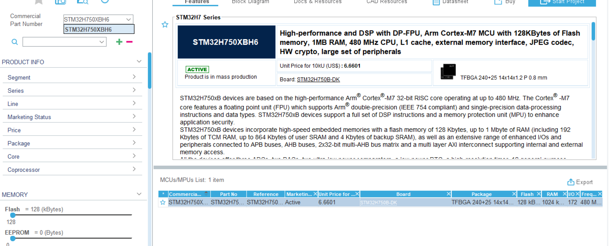

（2）基本工程设置

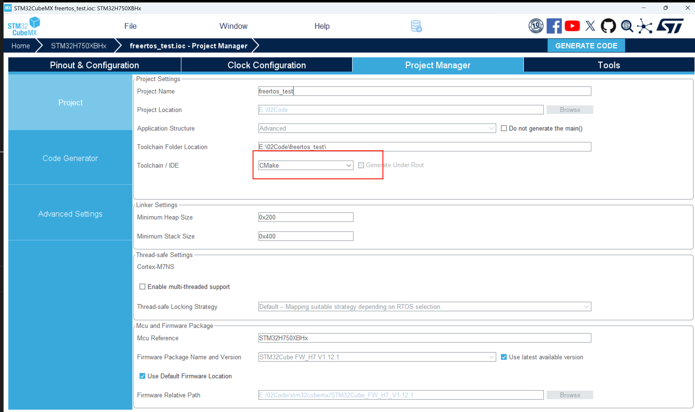

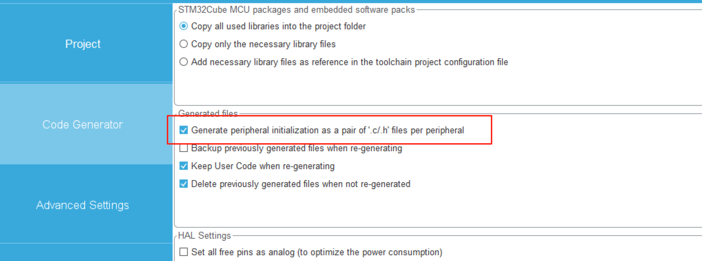

- 步骤2：配置主时钟（Clock Configuration）

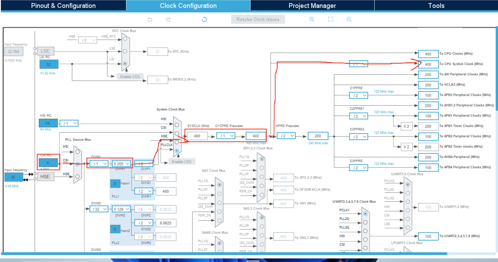

- 步骤3：启用调试与系统设置

`System Core > SYS`：Debug 模式设置为 **Serial Wire**，并根据开发板硬件参考手册配置pin脚

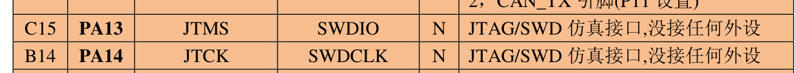

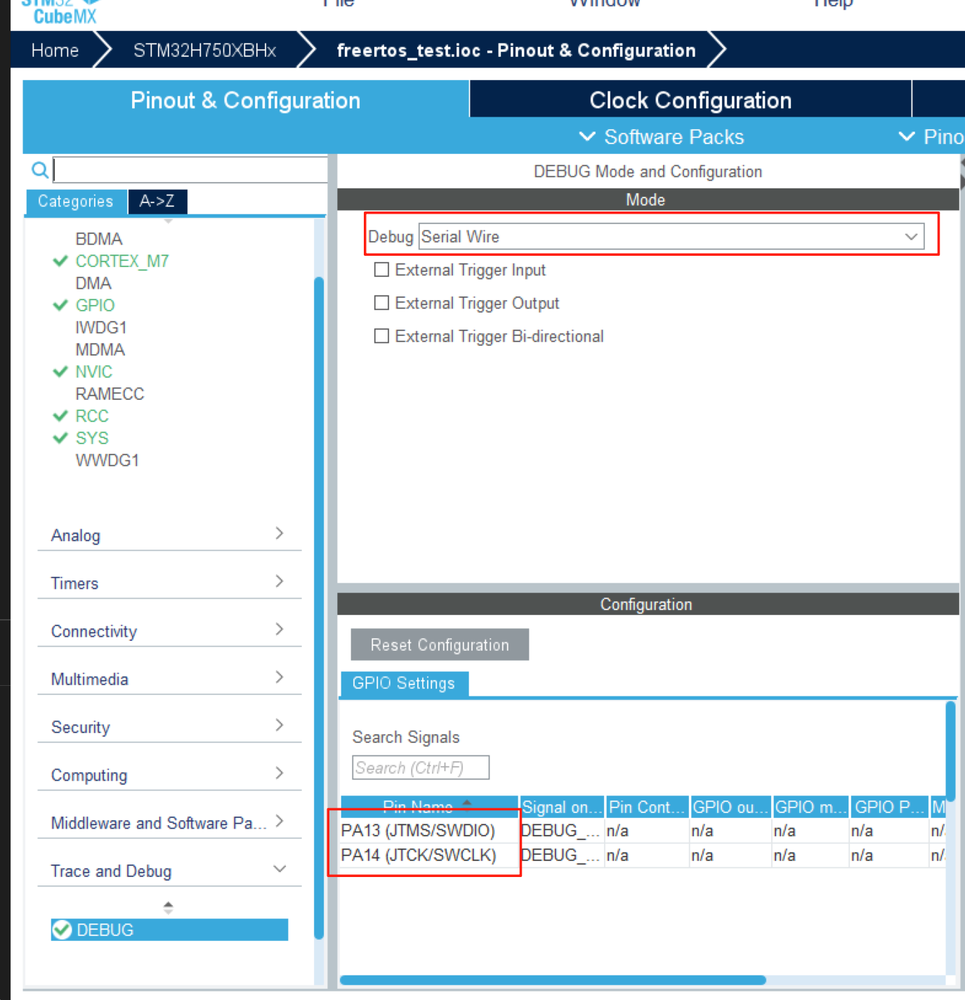

`System Core > RCC`：使用外部高速时钟 HSE

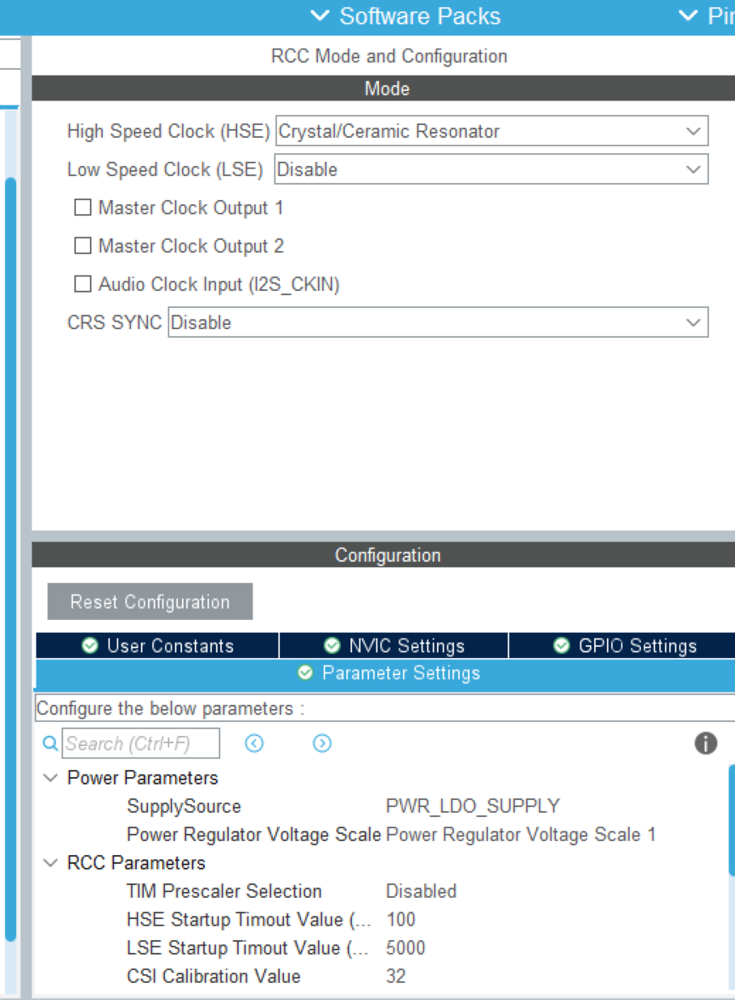

- 步骤4：启用串口（用于输出调试信息）

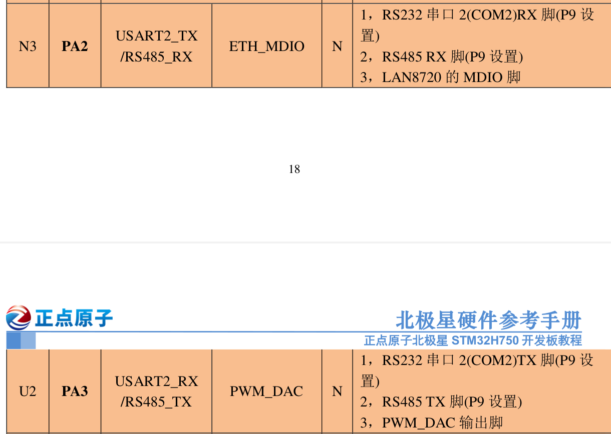

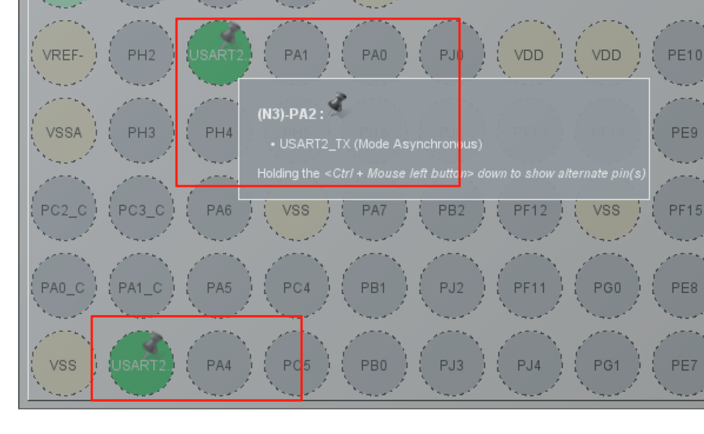

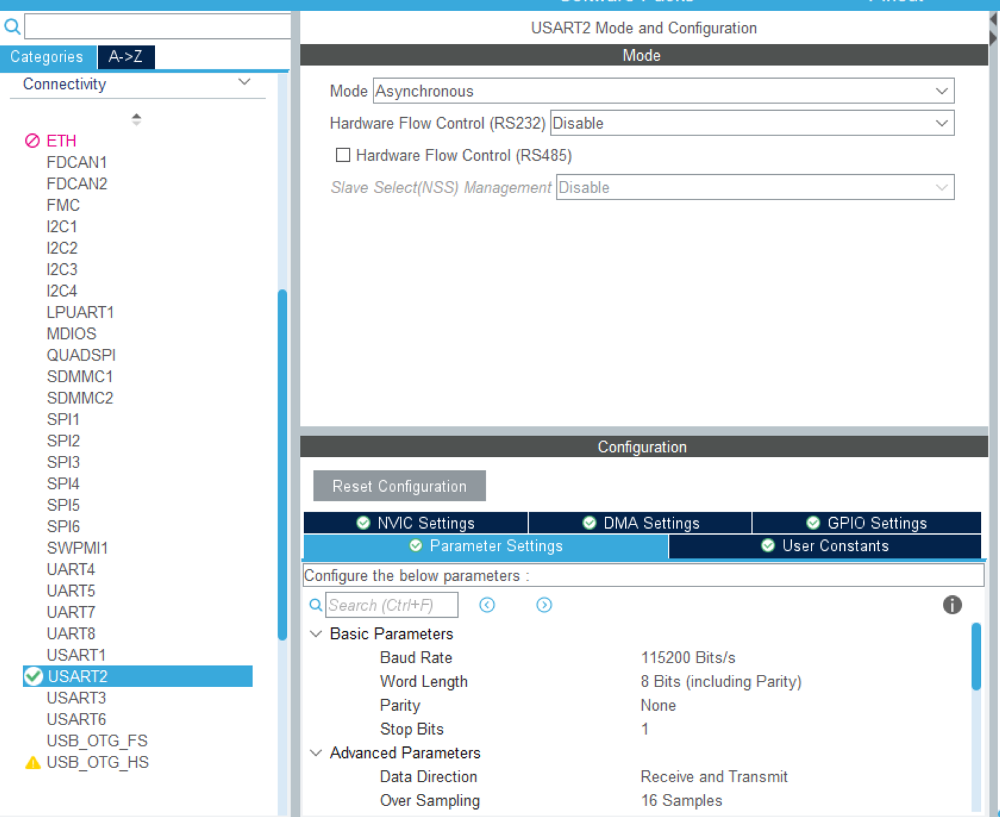

- 步骤5：配置FreeRTOS

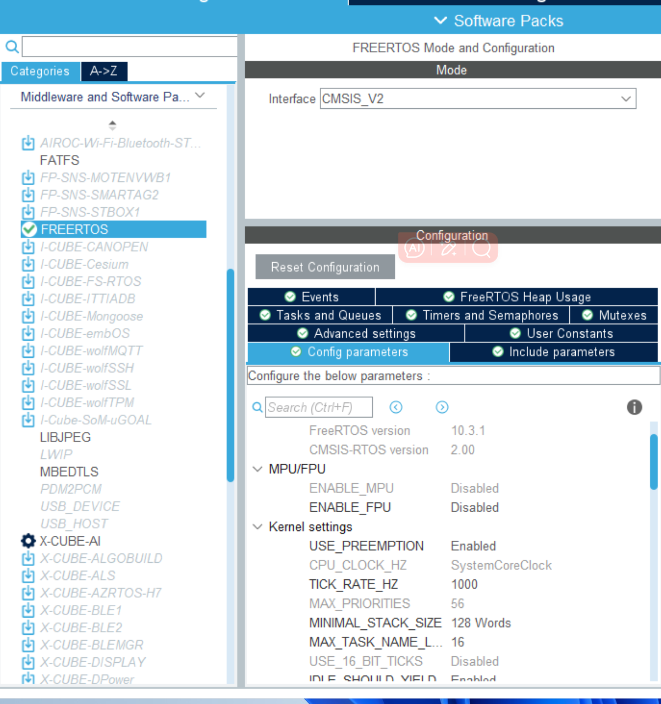

- 步骤6：确认 NVIC 和 SysTick 配置

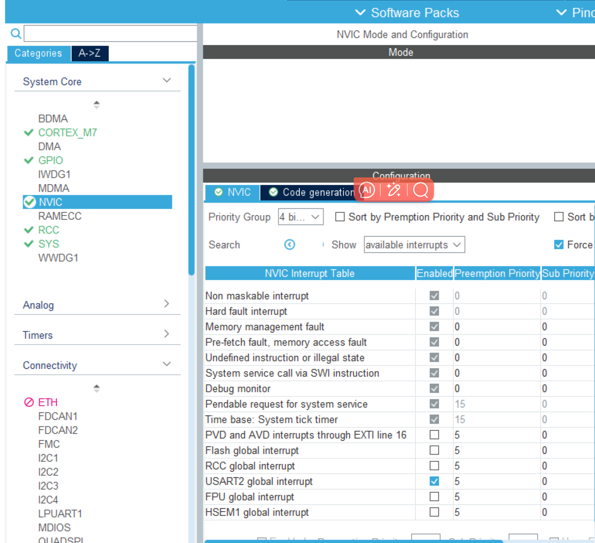

- 步骤7：生成代码

